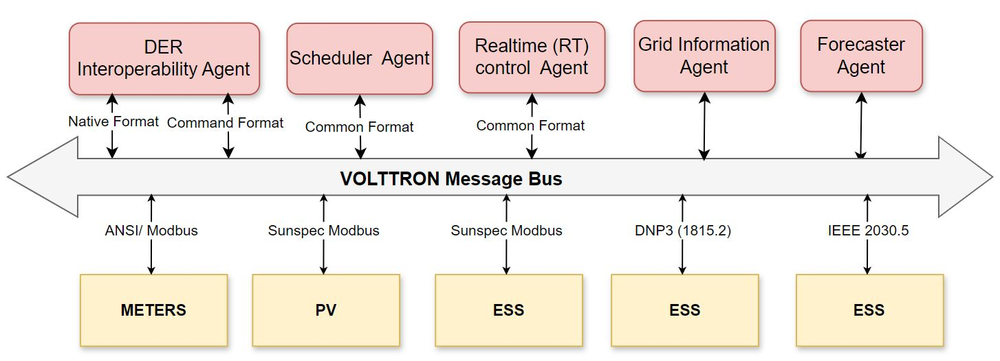

# The Interoperability Framework 

The Interoperability Framework, as shown in  and described in
, provides a set of VOLTTRON agents which
work together to enable seamless integration, control, and optimization of energy storage systems within a grid
environment, improving operational efficiency and grid stability. All agents communicate via VOLTTRON's message bus,
with the data flowing through the bus being stored in a database.
Visualization of the data is achieved through Grafana. Grafana is an open-source platform for monitoring,
visualizing, and analyzing metrics and log data from the various agents.

Figure: A suite of open-source VOLTTRON agents for an interoperable framework.
{#interop-framework-agents-diagram}

Table: Descriptions of interoperability agents. {#interop-framework-agents-table}

| Agent Name                                        | Description                                                                                                                                                                                                                                                                                                                                                                                                                                                                                                                                                                                                                                                                                                                                                                                                                                                                                                                                                                                                                                                                                                                  |
|---------------------------------------------------|------------------------------------------------------------------------------------------------------------------------------------------------------------------------------------------------------------------------------------------------------------------------------------------------------------------------------------------------------------------------------------------------------------------------------------------------------------------------------------------------------------------------------------------------------------------------------------------------------------------------------------------------------------------------------------------------------------------------------------------------------------------------------------------------------------------------------------------------------------------------------------------------------------------------------------------------------------------------------------------------------------------------------------------------------------------------------------------------------------------------------|
| [**Interoperability Agent**](interoperability.md) | Maps IEC 61850-7-420 data models into a common format, aligning them with the correct point names in protocols based on the IEEE 1547 standard. Supports communication standards such as SunSpec Modbus, IEEE 1815.2, and IEEE 2030.5. Ensures that devices with varying communication protocols can integrate seamlessly into a grid environment, improving device interoperability across multiple platforms.                                                                                                                                                                                                                                                                                                                                                                                                                                                                                                                                                                                                                                                                                                              |
| **Scheduler Agent**                               | Responsible for scheduling energy storage and grid operations using forecasted demand, generation, and pricing data. Integrates an optimization-based scheduler while remaining modular to support additional algorithmic approaches, ensuring efficient energy storage and usage based on real-time grid needs and energy price variations.                                                                                                                                                                                                                                                                                                                                                                                                                                                                                                                                                                                                                                                                                                                                                                                 |
| [**Real-Time Control (RT) Agent**](rt-control.md) | Actuates controls on energy storage systems. Designed for adaptability and efficiency in controlling grid operations in real-time. User-defined novel algorithms can be implemented in Python or Julia. Several pre-defined control algorithms are provided, including several MESA modes:    - **Charge/Discharge Power**: Operates based on a set schedule or specific set point.   - **Active Power Response**: Controls peak limiting, load following, and generation following.   - **Automatic Generation Control (AGC)**: Follows utility signals to balance power supply and demand.   - **Active Power Limit**: Restricts the maximum and minimum power output levels.   - **Active Power Smoothing**: Provides moving average control for smoothing power output.   - **Frequency Watt Modes**: Frequency-Watt Modes include Vertex and Gradient modes, advanced strategies for managing power output based on grid frequency deviations. Vertex Mode utilizes a piecewise linear control curve, while Gradient Mode uses a continuous, proportional response to stabilize the grid smoothly. |
| **Grid Information Agent**                        | Provides real-time and day-ahead data on CO₂ intensity, energy generation breakdown, and pricing information. Configurable to handle TOU pricing data for adjusting grid operations in response to market fluctuations.                                                                                                                                                                                                                                                                                                                                                                                                                                                                                                                                                                                                                                                                                                                                                                                                                                                                                                      |
| **Forecaster Agent**                              | Utilizes historical data from the VOLTTRON historian agent and a load forecast model to predict future energy load and outdoor temperature conditions. Helps utilities anticipate grid needs and optimize the scheduling and operation of energy storage systems.                                                                                                                                                                                                                                                                                                                                                                                                                                                                                                                                                                                                                                                                                                                                                                                                                                                            |

For more information and experimentation results, read the article:
[Interoperable Energy Storage Control and Communication Framework Development](
https://ieeexplore.ieee.org/abstract/document/10891219)

