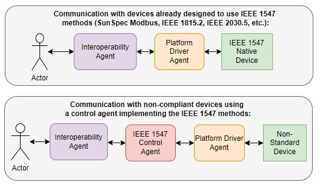
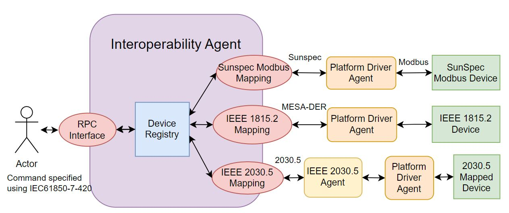

# The Interoperability Framework 

The VOLTTRON interoperability agent provides a standard, protocol-agnostic interface for Distributed Energy Resources (DER) devices by mapping IEC 61850-7-420 data models to protocols such as SunSpec Modbus, IEEE 1815.2, IEEE 2030.5, and custom protocols, in line with IEEE 1547 standards. It translates the required functionalities into specific protocols for device control. As illustrated in fig. \ref{fig:iop_agent}, an actor wishing to communicate with devices using multiple protocols compliant with IEEE 1547 can use the interoperability agent to manage all such devices. 

*Figure:The interoperability agent provides a standard, protocol-agnostic interface to DER devices. It maps IEC 61850-7-420 data models to the appropriate point names in protocols that implement specific versions of these models, in accordance with the IEEE 1547 interoperability standard, including SunSpec Modbus, IEEE 1815.2, and IEEE 2030.5*

The actor issues commands using IEC 61850-7-420 names, which the interoperability agent maps to specific protocols, such as SunSpec Modbus, MESA-DER (DNP3), or IEEE 2030.5. The corresponding points are then commanded on the devices via the VOLTTRON Platform Driver. If a device does not implement the data models specified in IEEE 1547, or the necessary functionality, the Interoperability Agent will lack a method for controlling it. In such cases, another agent may be used to implement the required functionality and expose a compliant data model. This secondary agent serves as an intermediary between the Interoperability Agent and the Platform Driver, as illustrated in fig.

*Figure:The Interoperability agent can be used independently or alongside control agents to: 1. Directly execute IEEE 1547 methods on devices with native support. 2. Apply IEEE 1547 methods to devices lacking native implementation.*

| Agent Name                | Description                                                                                                                                                       |
|---------------------------|-------------------------------------------------------------------------------------------------------------------------------------------------------------------|
| **Interoperability Agent**| Maps IEC 61850-7-420 data models into a common format, aligning them with the correct point names in protocols based on the IEEE 1547 standard. Supports communication standards such as SunSpec Modbus, IEEE 1815.2, and IEEE 2030.5. Ensures that devices with varying communication protocols can integrate seamlessly into a grid environment, improving device interoperability across multiple platforms. |
| **Scheduler Agent**       | Responsible for scheduling energy storage and grid operations using forecasted demand, generation, and pricing data. Integrates an optimization-based scheduler while remaining modular to support additional algorithmic approaches, ensuring efficient energy storage and usage based on real-time grid needs and energy price variations. |
| **Real-Time Control (RT) Agent** | Includes IEEE 1547 agent functionality, allowing control over non-standard devices. Designed for adaptability and efficiency in controlling grid operations in real-time. User-defined novel algorithms can be implemented in Python or Julia. Also includes various MESA modes:    - **Charge/Discharge Power**: Operates based on a set schedule or specific set point.   - **Active Power Response**: Controls peak limiting, load following, and generation following.   - **Automatic Generation Control (AGC)**: Follows utility signals to balance power supply and demand.   - **Active Power Limit**: Restricts the maximum and minimum power output levels.   - **Active Power Smoothing**: Provides moving average control for smoothing power output.   - **Frequency Watt Modes**: Frequency-Watt Modes include Vertex and Gradient modes, advanced strategies for managing power output based on grid frequency deviations. Vertex Mode utilizes a piecewise linear control curve, while Gradient Mode uses a continuous, proportional response to stabilize the grid smoothly. |
| **Grid Information Agent**| Provides real-time and day-ahead data on CO₂ intensity, energy generation breakdown, and pricing information. Configurable to handle TOU pricing data for adjusting grid operations in response to market fluctuations. |
| **Forecaster Agent**      | Utilizes historical data from the VOLTTRON historian agent and a load forecast model to predict future energy load and outdoor temperature conditions. Helps utilities anticipate grid needs and optimize the scheduling and operation of energy storage systems. |

These agents work together to enable seamless integration, control, and optimization of energy storage systems within a grid environment, improving operational efficiency and grid stability. All agents communicate via VOLTTRON's message bus, with the data flowing through the bus being stored in a PostgreSQL database. Visualization of the data is achieved through Grafana. Grafana is an open-source platform for monitoring, visualizing, and analyzing metrics and log data from various sources shown in the figure.

*Figure A suite of open-source VOLTTRON agents for an interoperable framework, where the interoperability agent translates IEC 61850-7-420 data models into a common format, aligning them with the correct point names in protocols based on the IEEE 1547 standard. It supports communication standards such as SunSpec Modbus, IEEE 1815.2, and IEEE 2030.5.*

For more information and experimentation results, read the article: [Interoperable Energy Storage Control and Communication Framework Development](https://ieeexplore.ieee.org/abstract/document/10891219)

