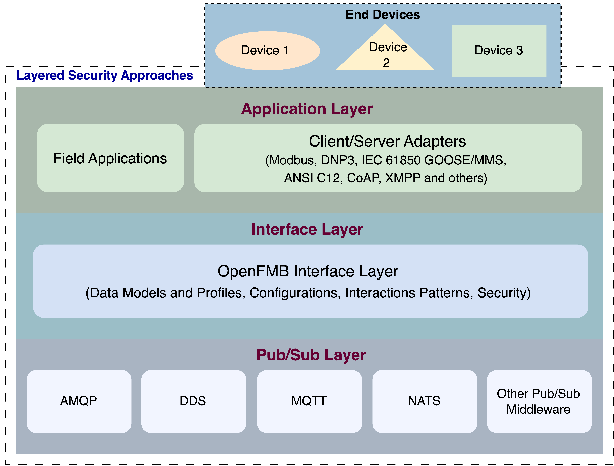
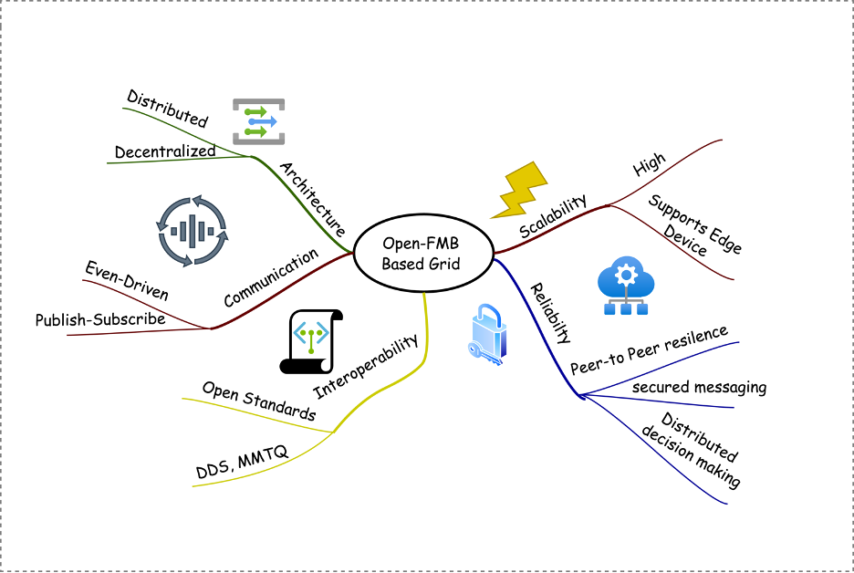

# OpenFMB 

Message Bus is a critical middleware component in the distributed systems architecture on various systems
and environments. Open Field Message Bus (open FMB) is an extensive framework for robust communication between
the microgrid controller and assets on the communication layer. OpenFMB was developed to reduce the complexities
of microgrid communication, such as low standards with the data structure combined with the communication protocols
towards the grid utilities. For instance, open FMB can be used to translate traditional protocols, including Modbus
and DNP3 and NATS. 

## Architecture 

Message buses provide asynchronous communication that performs message transfer between the senders and receivers
without a need for immediate response from the receivers as soon the sender sends the message. The components in
the message bus are independent which supports scalability and system resilience. Generally, message bus works based
on the publisher and subscriber. Open FMB is designed for three different layers, application, adapter and interface
layers. The architechture is shown in .

Figure: OpenFMB Architecture {#openfmb-architecture}

## Open-FMB Based Grid

The **Open-FMB Based Grid** is designed to enhance flexibility, interoperability, and efficiency in energy 
management systems.

Figure: OpenFMB Key Features and Properties {#openfmb-features}

**Key Features:**

1. **Distributed and Decentralized Architecture**: The Open-FMB framework is built upon a distributed and decentralized architecture, promoting localized decision-making and minimizing reliance on centralized control systems. This structure allows for enhanced adaptability and rapid response to changing conditions in the energy landscape.

2. **Event-Driven Communication**: The communication model is event-driven, utilizing a **publish-subscribe** mechanism that facilitates asynchronous message exchanges. This model allows devices to send and receive updates efficiently, ensuring real-time responsiveness.

3. **Interoperability**: The framework emphasizes **interoperability** among diverse devices and systems by leveraging **open standards** such as DDS (Data Distribution Service) and MQTT (Message Queuing Telemetry Transport). This ensures that equipment from various manufacturers can work together seamlessly.

4. **Scalability**: Open-FMB is designed for **high scalability**, allowing the system to grow and adapt without compromising performance. This is crucial in accommodating the increasing number of edge devices and data sources as the energy grid evolves.

5. **Reliability and Peer-to-Peer Resilience**: With a focus on **reliability**, the Open-FMB architecture provides mechanisms for **secure messaging** between devices. The peer-to-peer structure enhances resilience, allowing for uninterrupted communication even if individual components fail.

6. **Support for Edge Devices**: The architecture supports a wide range of **edge devices**, facilitating the integration of sensors, controllers, and other local elements that can actively participate in energy management and monitoring.

7. **Distributed Decision Making**: By enabling **distributed decision-making**, the Open-FMB Grid supports more efficient and localized responses to grid conditions, allowing for quicker adjustments based on real-time data.

